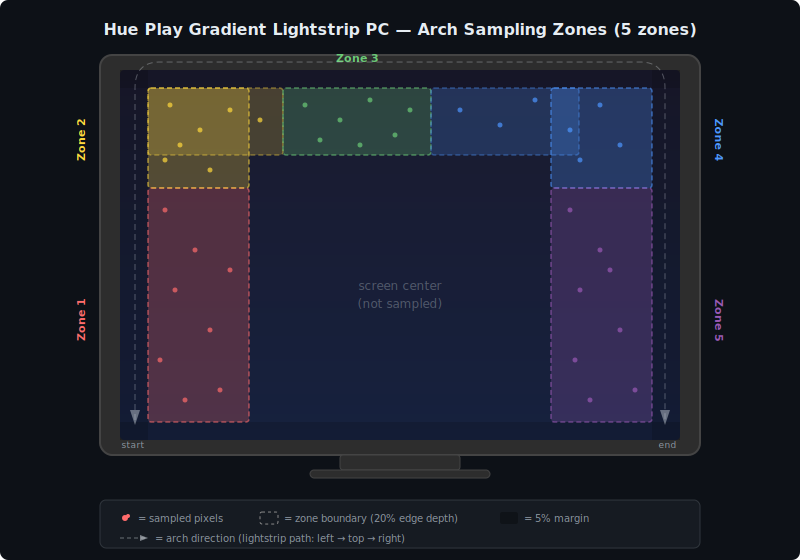

# Desktop Lights

Sync your monitor colors to Philips Hue Gradient Lightstrips in real time. Each screen is divided into zones that map directly to the gradient segments of your lightstrip, creating an ambient backlight effect.

Works with any number of monitors and lights. Remembers separate mappings for different monitor configurations (e.g., laptop only vs. docked with externals).

## Features

- Real-time screen color capture at 10-15 FPS
- Per-zone gradient control via Hue Bridge v2 API
- Configurable static brightness (default 60%)
- Multi-monitor support with automatic layout detection
- Profile-based config — remembers light mappings per monitor arrangement
- Flexible light-to-monitor mapping (multiple lights can follow the same monitor)
- Configurable zone orientation (reversed for opposite strip mounting)
- macOS menu bar app (no Dock icon)
- Builds as a standalone `.app` — no Python needed on target machine

## Requirements

- macOS (tested on macOS 15+)
- Python 3.11+ (for development/building)
- Philips Hue Bridge (v2 API)
- Philips Hue Play Gradient Lightstrip(s)
- Screen Recording permission (macOS will prompt on first launch)

## Quick Start

### From source

```bash
# Clone and set up
git clone <repo-url>
cd home-assistant-desktop-lights
python3 -m venv .venv
source .venv/bin/activate
pip install -e .

# First run — walks through bridge pairing and light discovery
python -m src.main
```

On first run you will be prompted to:

1. Discover or enter your Hue Bridge IP
2. Press the link button on the bridge to authenticate
3. Assign discovered gradient lights to monitors

On subsequent runs, the menu bar app launches and sync starts automatically.

### Pre-built app

Download `Desktop Lights.app` from Releases and drag it to `/Applications`.

On first launch, use the menu bar icon to:

1. **Setup Bridge** — discover and pair with your Hue Bridge
2. **Discover Lights** — find gradient-capable lights
3. **Map Lights** — assign each light to a monitor

## Building the App

```bash
source .venv/bin/activate
pip install pyinstaller
./build.sh
```

The output is `dist/Desktop Lights.app` (approximately 35 MB). Copy it to any Mac to install — no Python required.

## Menu Bar Controls

| Menu Item | Description |
|---|---|
| **Start/Stop Sync** | Toggle color syncing on/off |
| **FPS** | Current update rate |
| **Layout** | Current monitor fingerprint (e.g., `1920x1080_2560x1440`) |
| **Map Lights** | Assign each light to a monitor, toggle reversed orientation |
| **Brightness** | Set light brightness (20%, 40%, 60%, 80%, 100%) |
| **Setup Bridge** | Discover/pair with Hue Bridge |
| **Discover Lights** | Scan bridge for gradient-capable lights |

## Configuration

Settings are stored in `config.yaml` (created automatically). You can also edit it by hand.

### Profiles

Light mappings are stored per monitor layout. The layout fingerprint is based on connected monitor resolutions sorted by position (e.g., `1920x1080_2560x1440_1920x1080` for a three-monitor setup). When you connect or disconnect monitors, the app automatically switches to the matching profile.

```yaml
profiles:
  # Laptop only — both lights on the single screen
  1512x982:
    - monitor: 1
      light_id: "abc-123"
      light_name: "Left Strip"
      reversed: false
      zone_count: 5
    - monitor: 1
      light_id: "def-456"
      light_name: "Right Strip"
      reversed: false
      zone_count: 5

  # Docked with two external monitors — lights on left and right
  1512x982_1920x1080_1920x1080:
    - monitor: 2
      light_id: "abc-123"
      light_name: "Left Strip"
      reversed: false
      zone_count: 5
    - monitor: 3
      light_id: "def-456"
      light_name: "Right Strip"
      reversed: false
      zone_count: 5
```

### Sync Settings

```yaml
sync:
  fps: 12                  # Target frames per second (Hue Bridge caps at ~10 req/s per light)
  smoothing_alpha: 0.4     # Temporal smoothing (0 = none, higher = more smoothing)
  delta_threshold: 5.0     # Minimum color change to send an update
  brightness: 60           # Static brightness / opacity (0-100, also adjustable from menu bar)
  margin_percent: 5        # Skip this % of screen edges (avoids UI chrome)
  downsample_stride: 4     # Pixel sampling stride (higher = faster, less precise)
```

## How It Works

<p align="center">
  
</p>

1. **Screen capture** — `mss` grabs each monitor at the target FPS
2. **Zone sampling** — Colors are sampled along an arch that follows the lightstrip's physical path: up the left edge, across the top, and down the right edge. Each zone samples the outer 20% of the screen near its corresponding edge section
3. **Color conversion** — RGB colors are converted to CIE xy chromaticity with Gamut C clamping (the color space used by Hue lights)
4. **Temporal smoothing** — An exponential moving average smooths color transitions between frames
5. **Delta detection** — Updates are only sent when colors change beyond a threshold, reducing unnecessary bridge traffic
6. **Gradient update** — Colors are sent to the Hue Bridge v2 API as gradient points at a static configurable brightness (`PUT /clip/v2/resource/light/{id}`)

## Project Structure

```
home-assistant-desktop-lights/
├── pyproject.toml              # Project metadata and dependencies
├── config.yaml                 # Runtime configuration (auto-generated)
├── desktop_lights.spec         # PyInstaller build spec
├── build.sh                    # Build script
├── app_entry.py                # Entry point for .app bundle
├── src/
│   ├── main.py                 # CLI entry point (first-run setup → tray app)
│   ├── hue_bridge.py           # Hue Bridge v2 API client
│   ├── screen_capture.py       # mss-based screen capture + monitor detection
│   ├── color_processing.py     # RGB → CIE xy, gamut clamping, brightness, smoothing
│   ├── zone_mapper.py          # Screen → N vertical zones with mean color
│   ├── sync_engine.py          # Async capture → process → send loop
│   └── config_manager.py       # YAML config with profile support
├── ui/
│   └── tray_app.py             # macOS menu bar app (rumps)
└── tests/
    ├── test_color_processing.py  # Unit tests
    ├── test_gradient.py          # Manual: rainbow gradient on strips
    └── test_capture.py           # Manual: print zone colors per monitor
```

## Test Scripts

```bash
# Unit tests
python -m pytest tests/

# Set a rainbow gradient on all discovered lights
python -m tests.test_gradient

# Print sampled zone colors for each monitor
python -m tests.test_capture
```

## Troubleshooting

**Lights not responding** — Check that `config.yaml` has the correct bridge IP and app key. Re-run Setup Bridge if needed.

**Black screen / no capture** — Grant Screen Recording permission in System Settings > Privacy & Security > Screen Recording.

**Colors look wrong** — Try adjusting `margin_percent` (skip more edge pixels) or `downsample_stride` (lower = more accurate sampling).

**Flickering** — Increase `smoothing_alpha` (e.g., 0.6) for heavier temporal smoothing, or increase `delta_threshold` to skip minor changes.


## License

MIT
